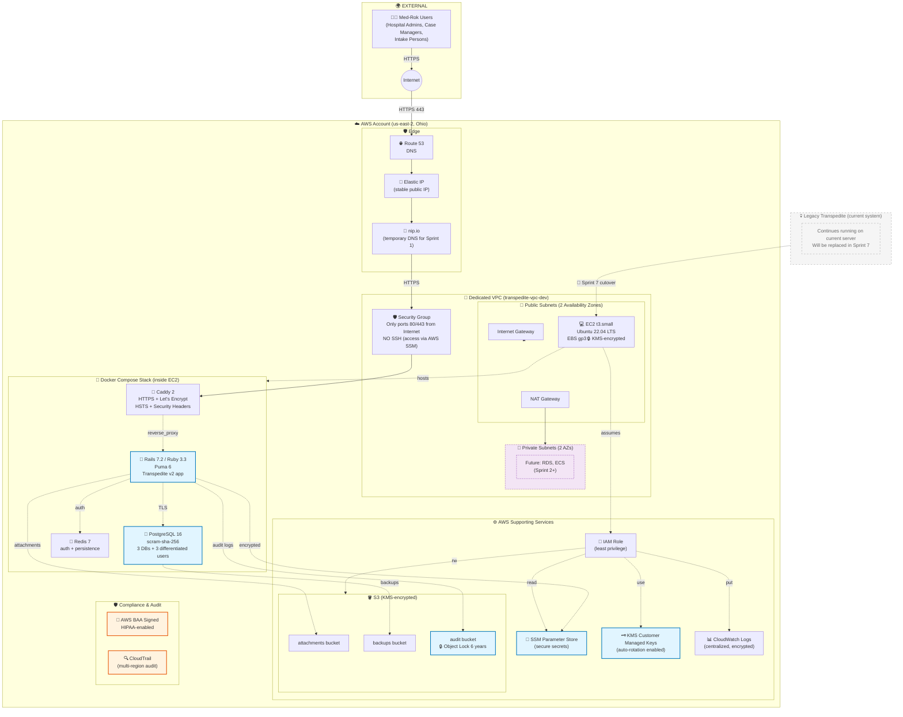
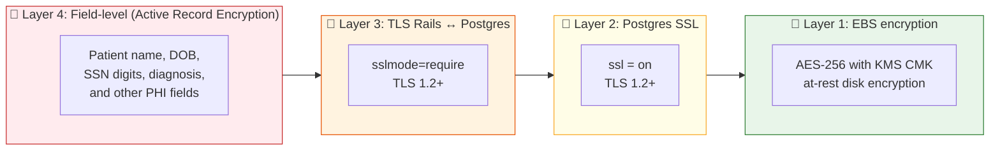
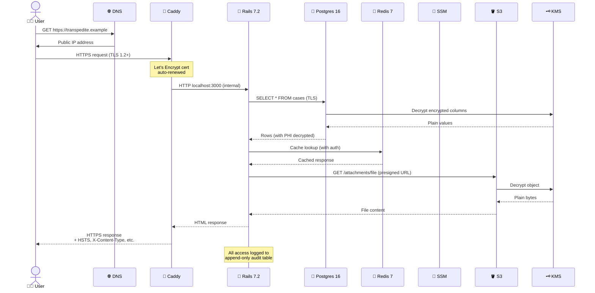

# Transpedite v2 — Architecture (Sprint 1)

> Visual overview of the infrastructure deployed in Sprint 1. Maintained by Toucan Talent.
> Last updated: 2026-05-12

---

## High-level architecture



---

## Architecture in plain language

### 🌍 External
End users (Med-Rok hospital admins, case managers, intake persons) access the system through the public Internet over HTTPS.

### 🛡️ AWS Edge
- **Route 53**: AWS-managed DNS. Will hold the client's real domain when provided.
- **Elastic IP**: a stable public IP attached to the EC2 instance.
- **nip.io**: a free public DNS service used during Sprint 1. It resolves IP-based hostnames automatically — no domain registration needed for the demo phase.

### 🔵 VPC + Subnets
A dedicated AWS Virtual Private Cloud isolates Transpedite from any other systems in the AWS account:
- **2 Availability Zones** for future high-availability
- **Public subnets** host the application EC2 and the NAT Gateway
- **Private subnets** are reserved for future database services (RDS) and container orchestration (ECS) starting Sprint 2
- **Security Group**: only TCP 80/443 from the internet is allowed. **No SSH port is open** — operational access is via AWS SSM Session Manager.

### 💻 EC2 + 🐳 Docker stack

A single EC2 instance (Ubuntu 22.04 LTS, EBS-encrypted disk) runs the entire application stack via Docker Compose:

| Service | Purpose |
|---|---|
| **Caddy 2** | HTTPS termination, automatic Let's Encrypt certificates, security headers (HSTS, X-Frame-Options, etc.), reverse proxy to Rails |
| **Rails 7.2** | Application server (Puma 6, Ruby 3.3) |
| **PostgreSQL 16** | Database with TLS, scram-sha-256 authentication, 3 separate databases (development/test/production), 3 users with differentiated permissions |
| **Redis 7** | Cache and background-job queue (Sidekiq), password authentication, on-disk persistence |

### ⚙️ AWS Supporting Services

| Service | Purpose |
|---|---|
| **S3** (3 buckets, KMS-encrypted) | Patient attachments, Postgres backups, audit logs (audit bucket has Object Lock 6 years per HIPAA) |
| **SSM Parameter Store** | All secrets stored as SecureString with KMS encryption (DB passwords, Rails secrets, encryption keys) |
| **KMS** | 5 Customer Managed Keys with automatic annual rotation, one per use case |
| **CloudWatch Logs** | Centralized application logging, encrypted with KMS, retention policies enforced |
| **IAM** | The EC2 assumes a least-privilege role granting access only to its own resources |

### 🛡️ Compliance & Audit
- **AWS BAA signed** at the Organization level → all of AWS is covered by the HIPAA contract.
- **CloudTrail**: multi-region audit of all AWS API activity. Required by HIPAA Security Rule §164.312(b).

### 💀 Legacy (current system)
The current Transpedite system continues running on the client's existing infrastructure during the entire modernization project. The new v2 system is built **in parallel** — never modifying the current system in-place. Migration of data is the final step in **Sprint 7**, executed as a snapshot + delta + DNS switchover + 30-day legacy read-only fallback period.

---

## Encryption layers (defense in depth)



If any single layer fails, the others continue protecting Protected Health Information (PHI). This satisfies HIPAA Security Rule §164.312 (Technical Safeguards — Encryption and Decryption).

---

## Request flow (what happens on each request)



---

## Project timeline

```mermaid
gantt
    title Transpedite v2 — Sprint Timeline
    dateFormat YYYY-MM-DD
    axisFormat %b %d

    section Sprint 1 (current)
    AWS Infrastructure        :done, infra, 2026-05-11, 2d
    Docker stack deployed     :done, stack, 2026-05-12, 1d
    HTTPS + Let's Encrypt     :done, tls, 2026-05-12, 1d
    Client demo               :crit, demo, 2026-05-13, 1d
    PHI Gate documented       :active, phi, 2026-05-14, 2d
    Migration plan            :active, mig, 2026-05-14, 2d

    section Sprint 2 (Foundation)
    Auth + MFA + RBAC         :s2auth, 2026-05-18, 5d
    Backups automated         :s2bk, 2026-05-18, 5d
    Audit logging             :s2au, 2026-05-21, 5d

    section Sprint 3-4 (Domain Core)
    Models: Case, Bed, Match  :s3, 2026-06-01, 14d
    Statesman state machines  :s3sm, 2026-06-01, 14d

    section Sprint 5 (Workflows)
    Matching engine           :s5m, 2026-06-15, 14d
    Notifications             :s5n, 2026-06-15, 14d
    Search                    :s5s, 2026-06-22, 7d

    section Sprint 6 (Client modules)
    Discharge Barrier         :s6db, 2026-06-29, 7d
    Inpatient Psych           :s6ip, 2026-06-29, 7d

    section Sprint 7 (CUTOVER)
    Migration scripts         :s7m, 2026-07-13, 7d
    PHI Gate (14 controls)    :crit, s7pg, 2026-07-20, 4d
    Penetration test          :crit, s7pen, 2026-07-20, 4d
    Cutover + Hypercare       :crit, s7co, 2026-07-27, 14d
```

---

## What's deployed today (Sprint 1)

| Aspect | Status |
|---|---|
| AWS infrastructure provisioned via Infrastructure-as-Code (Terraform) | ✅ Done |
| Docker stack (Caddy + Rails + Postgres + Redis) running on EC2 | ✅ Done |
| HTTPS with auto-renewed Let's Encrypt certificate | ✅ Done |
| AWS BAA signed at Organization level | ✅ Done |
| Encryption at-rest, in-transit, and field-level (4 layers) | ✅ Configured |
| PHI Gate of 14 mandatory HIPAA controls | 🟡 Documented, in progress |
| Migration plan from legacy | 🟡 In progress |
| Real PHI loaded into system | ❌ Not yet (gated by PHI Gate completion in Sprint 7) |

---

> **Note**: This diagram is updated at the end of each sprint to reflect the current architecture. The next snapshot will be added after Sprint 2.
