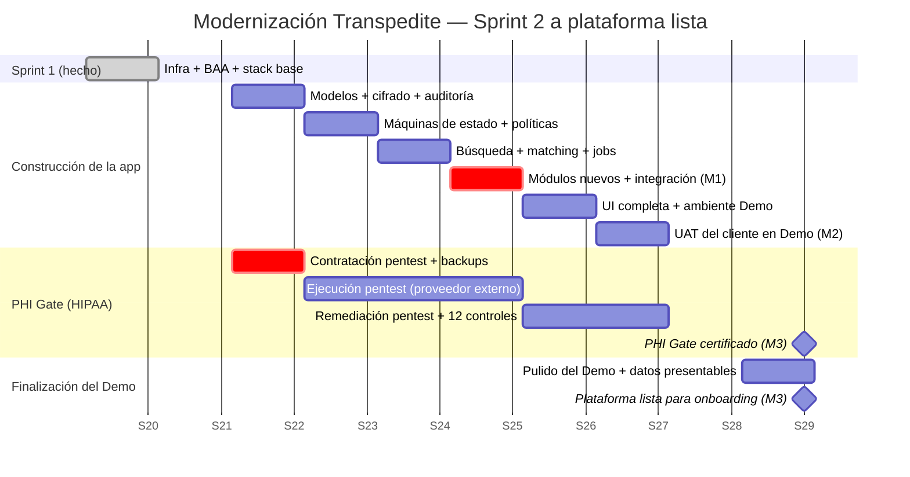

# Transpedite — Plan de Trabajo Detallado

> Documento público de planificación para la modernización de la plataforma Transpedite.
> Mantenido por **Toucan Talent** para **Med-Rok**.
> Última actualización: 2026-05-18

---

## ⏱ Duración del proyecto

**Proyecto completo: aproximadamente 2 meses desde el kickoff hasta el hito M3** (plataforma lista, PHI Gate certificado).

- ✅ **Sprint 1 — Cimientos (1 semana)**: completado
- **Sprint 2 en adelante — este plan (8 semanas restantes)**:
  - Semanas 1–4: Núcleo de la aplicación reconstruido (M1)
  - Semanas 5–6: Ambiente Demo listo, UAT del cliente (M2)
  - Semanas 7–8: Controles HIPAA verificados, pentest cerrado, PHI Gate certificado (M3)

Ver las secciones [Hitos](#hitos-milestones), [Diagrama de Gantt](#diagrama-de-gantt) y [Plan semana por semana](#plan-semana-por-semana) más abajo para el desglose completo.

---

## Propósito de este documento

Este plan cubre todo el trabajo desde el **Sprint 2 hasta la entrega de la plataforma modernizada lista para HIPAA, con un ambiente Demo en línea**.

**El Sprint 1 (cimientos) ya está completo** — ver [architecture-sprint-1.md](./architecture-sprint-1.md). 51 de 67 tareas del Sprint 1 cerradas (76%); la infraestructura base en AWS está operativa; el BAA con AWS está firmado; la plataforma técnica está lista para recibir la aplicación modernizada.

---

## Resumen ejecutivo

| | |
|---|---|
| **Objetivo** | Modernizar la plataforma Transpedite sobre un stack listo para HIPAA, con un ambiente Demo disponible para que Med-Rok presente la plataforma a hospitales potenciales. |
| **Enfoque** | **Reconstrucción en paralelo**: el sistema demo actual sigue disponible; la nueva plataforma se construye al lado; al final del proyecto, la plataforma modernizada reemplaza al Demo actual. |
| **Equipo** | 2 desarrolladores senior + flujo de trabajo asistido con IA. |
| **Duración total** | **~2 meses desde el kickoff hasta plataforma lista**. Sprint 1 (1 semana) ya está completo; este plan cubre las 8 semanas restantes. |
| **Qué incluye** | Dos ambientes — Desarrollo (interno) y Demo (visible al cliente). Controles HIPAA verificados y documentados (PHI Gate certificado listo). |
| **Qué NO incluye** | Ambientes de Producción para hospitales específicos (se provisionan bajo demanda cuando un hospital empiece a usar la plataforma con pacientes reales). |
| **Ya entregado** | Sprint 1: infraestructura AWS lista para HIPAA, BAA firmado, stack base de la aplicación, tablero de gestión, suite completa de documentación. |

---

## Ambientes

| Ambiente | Para qué sirve | Tipo de datos | Incluido en este contrato |
|---|---|---|---|
| **Desarrollo** | Interno — donde el equipo de desarrollo construye y prueba. Corre localmente. | Sintéticos, generados automáticamente | ✅ Sí |
| **Demo** | El cliente lo usa para presentar la plataforma a hospitales potenciales por URL. Se ve como un hospital real funcionando, pero todo lo de adentro es inventado. | Sintéticos, curados para verse realistas | ✅ Sí |
| **Producción (por hospital)** | Se activa cuando un hospital firma y va a usar la plataforma con pacientes reales. Todos los controles HIPAA activos y auditados. | **Datos reales de pacientes — regulados por HIPAA** | ❌ No incluido. Se provisiona por hospital, bajo demanda. |

**Por qué dos ambientes alcanzan en este contrato:** Todavía no hay ningún hospital usando la plataforma con pacientes reales. Provisionar un ambiente de Producción antes de que exista un hospital real usándolo significa pagar por infraestructura sin uso. Los ambientes de Producción se crean bajo demanda, uno por hospital, a medida que Med-Rok los firme.

---

## Hitos (Milestones)

| # | Hito | Semana | Qué recibe el cliente |
|---|---|---|---|
| **M1** | Núcleo de la aplicación reconstruido | Fin de Semana 4 | Los 34 modelos del dominio reconstruidos sobre Rails 7.2; máquinas de estado operativas; cifrado PHI configurado; tabla de auditoría de acceso operativa. Disponible para inspección técnica. |
| **M2** | Ambiente Demo listo para revisión del cliente | Fin de Semana 6 | Aplicación completa corriendo en el ambiente Demo con datos sintéticos curados. El cliente y el equipo de ventas pueden usarlo para presentar a hospitales prospects. |
| **M3** | **PHI Gate certificado — plataforma lista para onboarding de hospitales** | Fin de Semana 8 | Los 14 controles HIPAA verificados y documentados. Pentest externo aprobado. La plataforma está técnicamente lista para aceptar datos reales de cualquier hospital cuando se necesite. |

---

## Diagrama de Gantt

*Las fechas asumen kickoff el 2026-05-25 (el lunes siguiente a la aprobación del plan). Si la aprobación se demora, todas las fechas se corren por el mismo período.*

---

## Plan semana por semana

### Semana 1 — Kickoff
**Construcción:** Esqueleto de la aplicación sobre Rails 7.2 — clases de modelos, migraciones para las 27 tablas base, llaves de Active Record Encryption provisionadas en AWS, tabla de auditoría de acceso a PHI creada.
**HIPAA:** Proveedor de pentest externo contratado y agendado; infraestructura de backups automáticos construida.
**Entregable:** Esquema desplegado en el ambiente Demo.

### Semana 2 — Máquinas de estado y autorización
**Construcción:** Máquinas de estado del workflow de transferencias (Statesman), tablas de historial, políticas Pundit de autorización para cada controlador, flujo de preguntas de seguridad.
**HIPAA:** Drill de restauración de backups ejecutado y documentado (control #9).
**Entregable:** Workflow básico operativo con datos sintéticos; autenticación y autorización de usuarios completas.

### Semana 3 — Búsqueda, matching, jobs en background
**Construcción:** Algoritmo de matching paciente-cama; búsqueda full-text en PostgreSQL (reemplaza Solr del legacy); sistema de jobs para SLA tracking y notificaciones (reemplaza la batería de cron del legacy).
**HIPAA:** Ejecución del pentest (proveedor externo, en paralelo con el desarrollo).
**Entregable:** Motor de matching funcional; temporizadores SLA activos; búsqueda funcionando sobre casos y camas.

### Semana 4 — Módulos nuevos e integración ← **M1: Núcleo reconstruido**
**Construcción:** Módulo Discharge Barrier (checklist); módulo Inpatient Psych (perfil); tests de integración cubriendo el workflow completo de transferencias.
**HIPAA:** Pentest continúa; revisión de hallazgos preliminares si están disponibles.
**Entregable:** Todos los módulos funcionales construidos e integrados. El cliente puede revisar código y arquitectura.

### Semana 5 — Reconstrucción de UI y ambiente Demo
**Construcción:** Reconstrucción completa de la UI sobre el stack moderno; generación de PDF (face sheets); subida de archivos adjuntos al S3 cifrado (en el ambiente Demo).
**HIPAA:** Reporte de pentest recibido; trabajo de remediación comienza.
**Entregable:** Ambiente Demo totalmente operativo con datos sintéticos.

### Semana 6 — UAT del cliente en Demo ← **M2: Demo listo para revisión**
**Construcción:** Correcciones de bugs del UAT del cliente; afinamiento de performance; ejecución de load test.
**HIPAA:** Controles #4, #6, #7, #10, #12 restantes verificados y documentados.
**Acción del cliente:** Pruebas UAT de la aplicación contra los flujos del negocio.
**Entregable:** Aprobación funcional del cliente.

### Semana 7 — Controles HIPAA y pulido del Demo
**Construcción:** Correcciones finales de bugs; data del Demo curada para presentaciones de venta (nombres de pacientes, hospitales y casos realistas pero totalmente sintéticos).
**HIPAA:** Controles #5, #8, #11 verificados; política de incident response firmada; remediación del pentest completa.
**Entregable:** Data del Demo presentable; controles HIPAA en tiempo.

### Semana 8 — Certificación PHI Gate ← **M3: Plataforma lista**
**Construcción:** Pulido final del Demo.
**HIPAA:** Los 14 controles verificados, documentados individualmente, y firmados (incluido el control #14).
**Entregable:** Certificación del PHI Gate. La plataforma está técnicamente lista para aceptar el onboarding del primer hospital cuando aparezca.

---

## Qué necesitamos del cliente

Estos ítems determinan si el cronograma se sostiene:

| # | Qué necesitamos | Cuándo | Si no llega |
|---|---|---|---|
| 1 | Confirmación del alcance de los dos módulos nuevos (Discharge Barrier, Inpatient Psych) | **Fin de Semana 1** | Se sacan los módulos del alcance; el cliente puede agregarlos en un sprint posterior. |
| 2 | Disponibilidad del cliente para hacer UAT en el ambiente Demo | **Semana 6** | El UAT se corre más tarde; las semanas restantes se comprimen. |
| 3 | Decisión sobre si el pentest se contrata a través de este contrato o directo por el cliente | **Fin de Semana 1** | Si va por este contrato: nosotros reservamos al proveedor. Si va directo: el cliente lo reserva. Cualquiera sea la opción, el pentest debe arrancar al final de la Semana 1 para terminar a tiempo. |

---

## PHI Gate — los 14 controles

Aunque en este contrato no se carga ningún PHI real, el PHI Gate se certifica listo para que cuando Med-Rok firme el primer hospital no queden trabas de seguridad. Los 14 controles firmados al fin de la Semana 8:

| # | Control | Cuándo se verifica |
|---|---|---|
| 1 | BAA con AWS firmado | ✅ Hecho (Sprint 1) |
| 2 | EBS cifrado con KMS CMK | ✅ Hecho (Sprint 1) |
| 3 | S3 cifrado con KMS CMK | ✅ Hecho (Sprint 1) |
| 4 | Active Record Encryption operativo | Semana 6 |
| 5 | TLS end-to-end verificado (SSL Labs A/A+) | Semana 7 |
| 6 | Audit log de acceso a PHI operativo | Semana 6 |
| 7 | Políticas de autorización revisadas (Pundit) | Semana 6 |
| 8 | MFA activo para todos los administradores | Semana 7 |
| 9 | Drill de restauración de backups documentado | Semana 2 |
| 10 | Filtros de PHI en logs verificados | Semana 6 |
| 11 | Política de incident response firmada | Semana 7 |
| 12 | Disclaimers operativos | Semana 6 |
| 13 | Pentest externo aprobado | Semana 7 |
| 14 | Procedimiento de aislamiento de datos sintéticos documentado | Semana 8 |

---

## Riesgos y mitigaciones

| Riesgo | Impacto | Mitigación |
|---|---|---|
| El pentest encuentra hallazgos críticos | Puede retrasar el PHI Gate 1–2 semanas | El pentest está agendado para terminar en Semana 7, dejando buffer en Semana 8. |
| La lógica del dominio legacy revela complejidad desconocida | La fase de construcción se extiende 1–2 semanas | Buffer incorporado en Semana 6 (UAT) donde se acomodan las correcciones de bugs. |
| Scope creep en los módulos nuevos | La fase de construcción se extiende | Alcance congelado al fin de Semana 1. Los cambios se rutean a un contrato siguiente. |
| El proveedor del pentest tiene lead time mayor a 1 semana | El pentest termina más tarde | Contrato firmado en Semana 1; proveedores alternativos identificados como backup. |
| Med-Rok quiere onboardear un hospital antes de certificar el PHI Gate | Exposición HIPAA | El onboarding de hospitales sólo comienza después de certificar el PHI Gate (hito de Semana 8). |

---

## Enfoque: por qué "reconstrucción en paralelo" y no "lift and shift"

El demo actual de Transpedite corre sobre componentes tecnológicos que no reciben parches de seguridad hace años — algunos hace más de cinco años. Un sistema que maneja datos de pacientes sobre tecnología sin parches **no puede cumplir HIPAA**, sin importar la infraestructura alrededor. Esto no es opinión; es una línea base regulatoria.

Por eso el proyecto reconstruye la aplicación sobre un stack moderno y con soporte vigente, en lugar de simplemente mudar el código legacy a la nueva infraestructura AWS. El demo actual sigue operando durante todo el proyecto, sin interrupciones, hasta que la plataforma nueva esté lista para reemplazarlo.

La modernización cierra una brecha de cumplimiento que ya existe hoy. Es lo que habilita a Med-Rok a empezar a vender la plataforma a hospitales.

---

## Criterios de aceptación para la firma

Este plan se considera aprobado cuando:

- Los **3 hitos (M1–M3)** son aceptados como los resultados medibles del proyecto.
- Los **3 compromisos del cliente** están aceptados.
- El **cronograma de 8 semanas** está aprobado.

---

## Documentos relacionados

- [Diagrama de arquitectura (Sprint 1)](./architecture-sprint-1.md) — lo que ya se entregó.
- [English version of this plan](./work-plan.md) — same content in English.
- El detalle de los tickets del Sprint 1 y el historial completo de tareas se mantiene en el espacio de ClickUp del proyecto, gestionado por Toucan Talent; el cliente tiene acceso para visualización y comentarios.

---

> Este es un documento vivo. Se actualizará semanalmente durante la ejecución. Cualquier cambio al alcance, cronograma o hitos requiere acuerdo escrito entre ambas partes.
