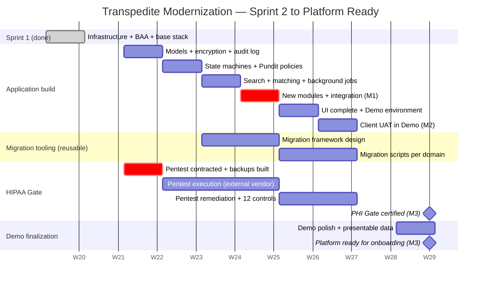

# Transpedite Modernization — Detailed Work Plan

> Public planning document for the modernization of the Transpedite platform.
> Maintained by **Toucan Talent** for **Med-Rok**.
> Last updated: 2026-05-18

---

## Purpose of this document

This plan covers all work from **Sprint 2 through delivery of a HIPAA-ready modernized platform with a live Demo environment**.

**Sprint 1 (foundation) is complete** — see [architecture-sprint-1.md](./architecture-sprint-1.md). 51 of 67 Sprint 1 tasks completed (76%); the foundational AWS infrastructure is operational; the AWS BAA is signed; the technical platform is ready to receive the modernized application.

---

## Executive summary

| | |
|---|---|
| **Goal** | Modernize the Transpedite platform on a HIPAA-ready stack, with a Demo environment available for Med-Rok to present the platform to potential hospital clients. |
| **Approach** | **Parallel rebuild**: the existing demo system stays available; the new platform is built next to it; the modernized platform becomes the Demo at the end of the project. |
| **Team** | 2 senior developers + AI-assisted development workflow (Claude). |
| **Duration** | **8 weeks** under the conditions stated in "What we need from the client". |
| **What's included** | Two environments — Development (internal) and Demo (client-facing). HIPAA controls verified and documented (PHI Gate certified ready). |
| **What's NOT included** | Production environments for specific hospitals. Per-hospital implementation work is a separate engagement (see Scope section below). |
| **Already delivered** | Sprint 1: HIPAA-ready AWS infrastructure, signed BAA, base application stack, project board, full documentation suite. |

---

## Scope — Two phases, two engagements

This is the critical structural point of the contract:

### Phase 1 — Platform modernization *(this contract)*

This contract delivers the **Transpedite platform** — the technology that future hospital clients will use, plus a permanent **Demo environment** for sales presentations.

It **includes**:
- The application rebuilt on a modern, supported stack (Rails 7.2, Ruby 3.3, PostgreSQL 16).
- All HIPAA security controls built into the code (encryption, audit logging, TLS, access controls).
- The PHI Gate certified ready — all 14 controls verified — so any hospital can be onboarded later with no security blockers.
- A Demo environment, accessible via URL, where Med-Rok can present the platform to potential hospital clients.
- Migration tooling (reusable framework) so future hospitals can be migrated efficiently.

It does **not** include:
- Provisioning a Production environment for any specific hospital.
- Migrating real patient data from any hospital.
- Onboarding any hospital's staff or training their users.

### Phase 2 — Per-hospital implementation *(separate engagement, each time)*

When the first hospital is ready to use the platform with real patients — **including the founder's own institution** — a separate implementation phase is needed:

- Provisioning a dedicated Production environment for that hospital.
- Migrating their existing data, if any (using the migration tooling built in Phase 1).
- Training their staff.
- Activating the PHI Gate controls for that specific environment.

This phase typically takes **1 to 3 weeks per hospital**, depending on whether they have existing data to migrate and the complexity of their setup. It is scoped, planned, and contracted separately, per hospital.

---

## Environments included in this contract

Three environments make up the full platform. **This contract covers two of them**; the third is provisioned separately, per hospital, when needed.

| Environment | Purpose | Data | Included in this contract |
|---|---|---|---|
| **Development** | Internal — for the development team to build and test. Runs locally. | Synthetic, generated automatically | ✅ Yes |
| **Demo** | Client uses this to present the platform to potential hospital customers via URL. Looks like a working hospital but everything inside is fabricated. | Synthetic, curated to look realistic | ✅ Yes |
| **Production (per hospital)** | Activated when a hospital signs and is ready to use the platform with real patients. Full HIPAA controls active and audited. | **Real patient data — HIPAA-regulated** | ❌ Not included. Provisioned per hospital during a Phase 2 implementation. |

**Why two environments are enough for this contract:** No hospital is using the platform with real patients yet. Provisioning a Production environment before there is a real hospital using it means paying for unused infrastructure. Production environments are created on demand, one per hospital, as Med-Rok signs them.

---

## Milestones

| # | Milestone | Week | What the client receives |
|---|---|---|---|
| **M1** | Application core rebuilt | End of Week 4 | All 34 domain models reconstructed on Rails 7.2; state machines operational; PHI encryption configured; access audit table live. Available for technical inspection. |
| **M2** | Demo environment ready for client review | End of Week 6 | Full application running in the Demo environment with curated synthetic data. Client and sales team can use it to present to hospital prospects. |
| **M3** | **PHI Gate certified — platform ready for hospital onboarding** | End of Week 8 | All 14 HIPAA controls verified and documented. External pentest passed. The platform is technically ready to accept any hospital's real data in a Phase 2 implementation. |

---

## Gantt chart

*Dates assume kickoff on 2026-05-25 (the Monday following plan approval). All dates shift by the same amount if approval is delayed.*

---

## Week-by-week plan

### Week 1 — Kickoff
**Build:** Application skeleton on Rails 7.2 — model classes, migrations for the 27 base tables, Active Record Encryption keys provisioned in AWS, PHI access audit table created.
**Migration tooling:** Initial design for the migration script framework (used in future per-hospital implementations).
**HIPAA:** External pentest vendor contracted and scheduled; automated backup infrastructure built.
**Deliverable:** Schema deployed in the Demo environment; framework scaffolded.

### Week 2 — State machines and authorization
**Build:** Transfer workflow state machines (Statesman), history tables, Pundit authorization policies for every controller, security questions flow.
**Migration tooling:** First migration script templates (users, hospitals, facilities).
**HIPAA:** Backup restore drill executed and documented (control #9).
**Deliverable:** Core workflow operational with synthetic data; user authentication and authorization complete.

### Week 3 — Search, matching, background jobs
**Build:** Patient-bed matching algorithm; PostgreSQL full-text search (replaces legacy Solr); background job system for SLA tracking and notifications (replaces legacy cron battery).
**Migration tooling:** Templates for cases, beds, and matches.
**HIPAA:** Pentest executes (external vendor, in parallel with development).
**Deliverable:** Matching engine functional; SLA timers active; search across cases and beds.

### Week 4 — New modules and integration ← **M1: Core rebuilt**
**Build:** Discharge Barrier checklist module; Inpatient Psychiatric profile module; integration tests covering the full transfer workflow end-to-end.
**Migration tooling:** All 8 migration script templates complete and tested with synthetic data.
**HIPAA:** Pentest continues; preliminary findings reviewed if available.
**Deliverable:** All functional modules built and integrated. Client can review code and architecture.

### Week 5 — UI rebuild and Demo environment
**Build:** Complete UI rebuild on the modern stack; PDF generation for face sheets; attachments uploading to encrypted S3 (in the Demo environment).
**Migration tooling:** Migration framework documented for use during per-hospital implementations.
**HIPAA:** Pentest report received; remediation work begins.
**Deliverable:** Demo environment fully operational with synthetic data.

### Week 6 — Client UAT in Demo ← **M2: Demo ready for client review**
**Build:** Bug fixes from client UAT; performance tuning; load test execution.
**HIPAA:** Remaining controls (#4, #6, #7, #10, #12) verified and documented.
**Client action:** UAT testing of the application against business workflows.
**Deliverable:** Functional sign-off from the client.

### Week 7 — HIPAA controls and Demo polish
**Build:** Final bug fixes; Demo data curated for sales presentations (realistic but fully synthetic patient names, hospitals, cases).
**HIPAA:** Controls #5, #8, #11 verified; incident response policy signed off; pentest remediation complete.
**Deliverable:** Demo data presentable; HIPAA controls on track.

### Week 8 — PHI Gate certification ← **M3: Platform ready**
**Build:** Final Demo polish; documentation of the per-hospital implementation playbook (used in Phase 2).
**HIPAA:** All 14 controls verified, individually documented, and signed off (control #14 included).
**Deliverable:** PHI Gate certificate. The platform is technically ready to accept the first hospital onboarding (Phase 2 engagement).

---

## What we need from the client

These items determine whether the timeline holds:

| # | What we need | When | If missed |
|---|---|---|---|
| 1 | Confirmation of scope for the two new modules (Discharge Barrier, Inpatient Psych) | **By end of Week 1** | Modules removed from scope; client can add them in a later sprint. |
| 2 | Client availability for UAT testing in the Demo environment | **Week 6** | UAT shifts later; remaining weeks compress. |
| 3 | Decision on whether the pentest vendor is engaged through this contract or directly by the client | **By end of Week 1** | If through this contract: we book the vendor. If direct: client books it. Either way, pentest must start by end of Week 1 to finish on time. |

---

## PHI Gate — the 14 controls

Although no real PHI is loaded during this contract, the PHI Gate is certified ready so that when Med-Rok signs the first hospital, no security blockers remain. All 14 controls signed off by Week 8:

| # | Control | When verified |
|---|---|---|
| 1 | AWS BAA signed | ✅ Done (Sprint 1) |
| 2 | EBS encryption with KMS CMK | ✅ Done (Sprint 1) |
| 3 | S3 encryption with KMS CMK | ✅ Done (Sprint 1) |
| 4 | Active Record Encryption operational | Week 6 |
| 5 | End-to-end TLS verified (SSL Labs A/A+) | Week 7 |
| 6 | PHI access audit log operational | Week 6 |
| 7 | Authorization policies reviewed (Pundit) | Week 6 |
| 8 | MFA active for all admins | Week 7 |
| 9 | Backup restore drill documented | Week 2 |
| 10 | PHI filters in logs verified | Week 6 |
| 11 | Incident response policy signed | Week 7 |
| 12 | Disclaimers operational | Week 6 |
| 13 | External pentest passed | Week 7 |
| 14 | Synthetic data isolation procedure documented | Week 8 |

---

## Risks and mitigations

| Risk | Impact | Mitigation |
|---|---|---|
| Pentest finds critical issues | Could delay HIPAA Gate by 1–2 weeks | Pentest scheduled to finish by Week 7, leaving buffer in Week 8. |
| Legacy domain logic reveals unknown complexity | Build phase extends 1–2 weeks | Built-in buffer in Week 6 (UAT) where bug fixes are scoped. |
| Scope creep on new modules | Build phase extends | Scope frozen at end of Week 1. Changes route to a follow-on engagement. |
| Pentest vendor lead time longer than 1 week | Pentest finishes later | Contract signed Week 1; alternate vendors identified as backup. |
| Med-Rok wants to onboard a hospital before PHI Gate is certified | HIPAA exposure | Hospital onboarding (Phase 2) only begins after Week 8 milestone is signed off. |

---

## Approach: why "parallel rebuild" and not "lift and shift"

The current Transpedite demo runs on technology components that have not received security patches for years — some for more than five years. A system that handles patient data on unpatched technology **cannot be HIPAA-compliant**, regardless of the surrounding infrastructure. This is not a matter of opinion; it is a regulatory baseline.

For that reason, the project rebuilds the application on a modern, supported stack rather than simply moving the legacy code onto the new AWS infrastructure. The current demo keeps operating throughout the project, without interruption, until the new platform is ready to replace it.

The modernization closes a compliance gap that exists today. It is what enables Med-Rok to start selling the platform to hospitals.

---

## Acceptance criteria for sign-off

This plan is considered approved when:

- The **3 milestones (M1–M3)** are accepted as the project's measurable outcomes.
- The **scope separation between Phase 1 and Phase 2** is acknowledged.
- The **3 client commitments** are accepted.
- The **8-week timeline** is approved.

---

## Sign-off

| Role | Name | Date | Signature |
|---|---|---|---|
| Client representative — Med-Rok | _________________________ | __ / __ / ____ | _________________________ |
| Toucan Talent — Project owner | Jorge Delgadillo | __ / __ / ____ | _________________________ |
| Toucan Talent — Lead developer | Javier Rodriguez | __ / __ / ____ | _________________________ |

---

## Related documents

- [Architecture diagram (Sprint 1)](./architecture-sprint-1.md) — what was delivered.
- [Spanish version of this plan](./plan-de-trabajo.md) — same content in Spanish.
- Sprint 1 work and detailed ticket history is maintained by Toucan Talent in the project's ClickUp workspace; the client has access for visibility and comments.

---

> This is a working document. The plan will be updated weekly during execution. Any change to scope, timeline, or milestones requires written agreement from both parties.
