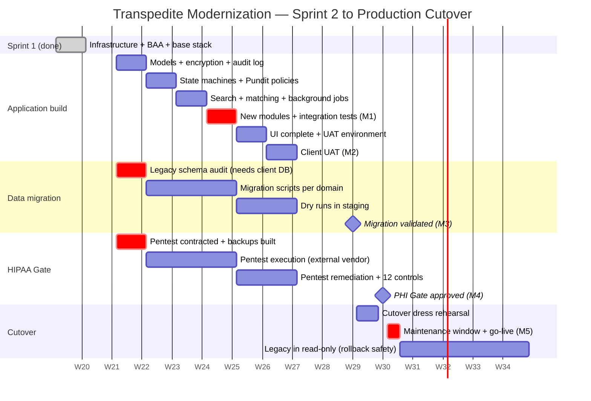

# Transpedite Modernization — Detailed Work Plan

> Public planning document for the modernization of the Transpedite system.
> Maintained by **Toucan Talent** for **Med-Rok**.
> Last updated: 2026-05-18

---

## Purpose of this document

This plan covers all work from **Sprint 2 through production cutover with full HIPAA compliance**. It is the document we ask the client to review and approve before kickoff of the next phase of the project.

**Sprint 1 (foundation) is complete** — see [architecture-sprint-1.md](./architecture-sprint-1.md) for what was delivered. 51 of 67 Sprint 1 tasks completed (76%), foundational infrastructure operational, AWS BAA signed, and the technical platform is ready to receive the modernized application.

---

## Executive summary

| | |
|---|---|
| **Goal** | Replace the legacy Transpedite system with a modern, HIPAA-compliant platform on AWS, with **no service interruption** for current users. |
| **Approach** | **Parallel rebuild**: the current legacy system stays operational throughout the project; the new platform is built next to it; data is migrated in a controlled cutover at the end. |
| **Team** | 2 senior developers + AI-assisted development workflow (Claude). |
| **Duration from kickoff to production cutover** | **8 to 10 weeks** (≈ 2 to 2.5 months) under the conditions stated in "What we need from the client". |
| **Cutover target** | End of Week 10 from kickoff, conditional on client dependencies below. |
| **Already delivered** | Sprint 1: HIPAA-ready AWS infrastructure, signed BAA, base application stack, project board, full documentation suite. |

---

## Milestones

| # | Milestone | Week | What the client receives |
|---|---|---|---|
| **M1** | Application core rebuilt | End of Week 4 | All 34 domain models reconstructed on Rails 7.2; state machines operational; PHI encryption configured; access audit table live. Available for technical inspection. |
| **M2** | Modernized application ready for UAT | End of Week 6 | Full functional application in staging with synthetic data. Client can use it. |
| **M3** | Migration validated in staging | End of Week 8 | Migration scripts executed end-to-end with realistic dataset, validations passed, recovery time objective (RTO) measured. |
| **M4** | PHI Gate approved | End of Week 9 | All 14 HIPAA controls verified, including external pentest. Formal sign-off. |
| **M5** | **Production cutover** | Week 10 | Real data migrated, DNS switched to new platform, legacy in read-only mode. System live with patient data under full HIPAA compliance. |

---

## Gantt chart

*Dates assume kickoff on 2026-05-25 (week following plan approval). All dates shift by the same amount if approval is delayed.*

---

## Week-by-week plan

### Week 1 — Kickoff
**Build:** Application skeleton on Rails 7.2 — model classes, migrations for the 27 base tables, Active Record Encryption keys provisioned in AWS, PHI access audit table created.
**Migration:** Legacy schema audit begins (requires client database access — see Dependencies).
**HIPAA:** External pentest vendor contracted and scheduled; automated backup infrastructure built.
**Deliverable:** Schema deployed in staging; migration framework scaffolded.

### Week 2 — State machines and authorization
**Build:** Transfer workflow state machines (Statesman), history tables, Pundit authorization policies for every controller, security questions flow.
**Migration:** First migration scripts written (users, hospitals, discharge facilities).
**HIPAA:** Backup restore drill executed and documented (control #9).
**Deliverable:** Core workflow operational with synthetic data; user authentication and authorization complete.

### Week 3 — Search, matching, background jobs
**Build:** Patient-bed matching algorithm; PostgreSQL full-text search (replaces legacy Solr); background job system for SLA tracking and notifications (replaces legacy cron battery).
**Migration:** Migration scripts for cases, beds, and matches.
**HIPAA:** Pentest executes (external vendor, in parallel with development).
**Deliverable:** Matching engine functional; SLA timers active; search across cases and beds.

### Week 4 — New modules and integration ← **M1: Core rebuilt**
**Build:** Discharge Barrier checklist module; Inpatient Psychiatric profile module; integration tests covering the full transfer workflow end-to-end.
**Migration:** All 8 migration scripts complete; first end-to-end dry run with synthetic data.
**HIPAA:** Pentest continues; preliminary findings reviewed if available.
**Deliverable:** All functional modules built and integrated. Client can review code and architecture.

### Week 5 — UI rebuild and UAT environment
**Build:** Complete UI rebuild on the modern stack; PDF generation for face sheets; attachments uploading to encrypted S3.
**Migration:** Dry run with anonymized subset of client data (if provided) or full-volume synthetic dataset.
**HIPAA:** Pentest report received; remediation work begins (typically 0–1 week depending on findings).
**Deliverable:** UAT environment available for client testing.

### Week 6 — Client UAT ← **M2: Ready for UAT**
**Build:** Bug fixes from client testing; performance tuning; load test execution.
**Migration:** Second dry run with refined scripts based on Week 5 findings.
**HIPAA:** Remaining controls (#4, #6, #7, #10, #12) verified and documented.
**Client action:** UAT testing of the application against business workflows.
**Deliverable:** Functional sign-off from the client.

### Week 7 — Dry runs and HIPAA close
**Build:** Final bug fixes; production environment configured and locked down.
**Migration:** Full dry run with real client data subset; validation against legacy (record counts, sample integrity checks).
**HIPAA:** Controls #5, #8, #11, #14 verified; incident response policy signed off; pentest remediation complete.
**Deliverable:** Migration RTO measured and documented.

### Week 8 — Validation and pre-cutover ← **M3: Migration validated**
**Build:** Production deployment dress rehearsal.
**Migration:** Final dry run; client reviews migrated data sample.
**HIPAA:** All 14 controls verified and individually documented.
**Client action:** Data sample review and sign-off.
**Deliverable:** Migration approved; cutover plan signed.

### Week 9 — PHI Gate approval and cutover prep ← **M4: PHI Gate approved**
**Build:** Production environment frozen for go-live.
**Migration:** Cutover runbook walkthrough with operations team.
**HIPAA:** Formal PHI Gate sign-off document issued.
**Client action:** Maintenance window confirmed with end users.
**Deliverable:** PHI Gate certificate. Cutover scheduled.

### Week 10 — Cutover ← **M5: Production live**
- Maintenance window begins (1–2 hours, off-peak).
- Legacy system to read-only mode.
- Final snapshot of legacy database.
- Delta data migration executed.
- Validation: record counts, checksums, sample reviews.
- DNS switchover to new platform.
- Smoke tests with real users.
- Legacy remains in read-only mode for 30 days as rollback safety.
- **Production live with patient data under full HIPAA compliance.**

---

## What we need from the client

These three items determine whether the timeline holds:

| # | What we need | When | If missed |
|---|---|---|---|
| 1 | Approved access to a copy of the current production database (anonymized or under BAA) | **By end of Week 1** | Migration audit blocked; project schedule slips week-for-week from Week 4 onward. |
| 2 | Confirmation of scope for the two new modules (Discharge Barrier, Inpatient Psych) | **By end of Week 1** | Modules removed from scope; client can add them in a post-cutover sprint. |
| 3 | Maintenance window for the cutover (1–2 hours, off-peak) | **By end of Week 8** | Cutover delayed until a window is available. |

Additional client participation needed:
- **Week 6 — UAT testing** with the team's case managers / intake personnel.
- **Week 8 — Data sample review** after the final dry run.
- **Week 9 — Maintenance window confirmation** with end users.

---

## PHI Gate — the 14 controls

The cutover requires all 14 controls signed off:

| # | Control | When verified |
|---|---|---|
| 1 | AWS BAA signed | ✅ Done (Sprint 1) |
| 2 | EBS encryption with KMS CMK | ✅ Done (Sprint 1) |
| 3 | S3 encryption with KMS CMK | ✅ Done (Sprint 1) |
| 4 | Active Record Encryption operational | Week 1 |
| 5 | End-to-end TLS verified (SSL Labs A/A+) | Week 7 |
| 6 | PHI access audit log operational | Week 1 |
| 7 | Authorization policies reviewed (Pundit) | Week 2 |
| 8 | MFA active for all admins | Week 7 |
| 9 | Backup restore drill documented | Week 2 |
| 10 | PHI filters in logs verified | Week 6 |
| 11 | Incident response policy signed | Week 7 |
| 12 | Disclaimers operational | Week 6 |
| 13 | External pentest passed | Week 7 |
| 14 | Synthetic test data removed before PHI load | Week 9 |

---

## Risks and mitigations

| Risk | Impact | Mitigation |
|---|---|---|
| Pentest finds critical issues | Could delay HIPAA Gate by 1–2 weeks | Pentest scheduled to finish by Week 7, leaving 2–3 weeks of buffer before cutover. |
| Client DB access delayed | Migration audit blocked; full timeline slips | Build phase can proceed with synthetic data through Week 4; beyond that, slippage is week-for-week. |
| Legacy domain logic reveals unknown complexity | Build phase extends 1–2 weeks | Built-in buffer in Week 6 (UAT) where bug fixes are scoped. |
| Scope creep on new modules | Build phase extends | Scope frozen at end of Week 1. Changes route to a post-cutover sprint. |
| Maintenance window unavailable on planned date | Cutover delays | Multiple candidate windows pre-agreed in Week 8. |
| Pentest vendor lead time longer than 1 week | Pentest finishes later, may compress remediation window | Contract signed Week 1; alternate vendors identified as backup. |

---

## Approach: why "parallel rebuild" and not "lift and shift"

The current Transpedite system runs on technology components that have not received security patches for years — some for more than five years. A system that handles patient data on unpatched technology **cannot be HIPAA-compliant**, regardless of the surrounding infrastructure. This is not a matter of opinion; it is a regulatory baseline.

For that reason, the project rebuilds the application on a modern, supported stack rather than simply moving the legacy code onto the new AWS infrastructure. The current system keeps operating throughout the project, without interruption, and is replaced in a controlled cutover at the end. The client never loses access to their system during the project.

The modernization closes a compliance gap that already exists today. It is not a discretionary upgrade.

---

## Acceptance criteria for sign-off

This plan is considered approved when:

- The **5 milestones (M1–M5)** are accepted as the project's measurable outcomes.
- The **3 client dependencies** are accepted as commitments by the client.
- The **8–10 week timeline** is approved.
- The cost framework (separate document, agreed during Sprint 1) is in effect.

---

## Sign-off

| Role | Name | Date | Signature |
|---|---|---|---|
| Client representative — Med-Rok | _________________________ | __ / __ / ____ | _________________________ |
| Toucan Talent — Project owner | Jorge Delgadillo | __ / __ / ____ | _________________________ |
| Toucan Talent — Lead developer | Javier Rodriguez | __ / __ / ____ | _________________________ |

---

## Related documents

- [Architecture diagram (Sprint 1)](./architecture-sprint-1.md) — what was already delivered.
- Sprint 1 work and detailed ticket history is maintained by Toucan Talent in the project's ClickUp workspace; the client has access for visibility and comments.

---

> This is a working document. The plan will be updated weekly during execution; each update will reference this baseline. Any change to scope, timeline, or milestones requires written agreement from both parties.
